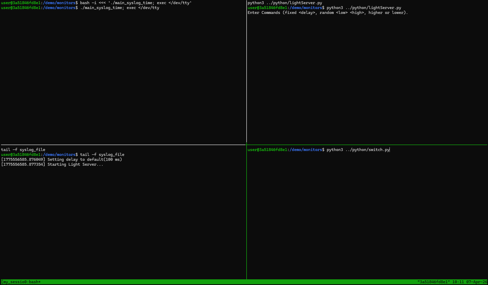

<!--
SPDX-License-Identifier: CC-BY-SA-4.0
-->

# Basic

## Build

Assuming the code base was previously cloned during [Environment Setup](../copilot/EnvSetup.md) and a devcontainer approach is used.

Build the demo

```
# Within the devcontainer, started by opening the repo via the VSCode GUI or executing `code .` within the clone.
cd /workspaces/wg-aerospace/demos/copilot/src/monitors
make prep  # Starts the devcontainer locally on first use
make       # Runs Haskell & Builds demo applications
```

## Launch

```
make run
```

- This will open a window in a TMUX environment with 4 sub-windows:
  - The monitoring application: `./main_syslog_time; exec </dev/tty`
  - The light server application: `python3 ../python/lightServer.py`
  - The switch application: `python3 ../python/switch.py`
  - The syslog file output: `tail -f syslog_file`


> It should look like this:
>
> 
  
- In the latter, the command to run is already prepared as:
  - `python3 ../python/switch.py`
  - Switch between windows using `CTRL+b` and the arrow keys
  - ....which can be run to start the demo
- To exit the TMUX environment:
  - Press `CTRL+b`
  - type `:kill-session` <Enter>

## Future improvements

- How to extend / using it for your own cases.
- Example modifying app behavior (run for consistent results)
- Tailor copilot spec (run for consistent results)
- Modify system to prove spec/monitor tailoring captures intended behavior
- Extend the docs - Do we want to draw a mermaid diagram and have copilot auto gen the monitor?
