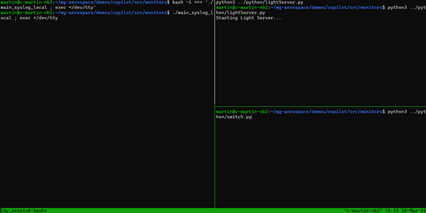

# Basic


## Build

Assuming the code base was previously cloned during [Environment Setup](../copilot/EnvSetup.md) as follows.

```
cd ~
git clone https://github.com/elisa-tech/wg-aerospace.git
```

Build the demo

```
cd ~/wg-aerospace/demos/copilot/src/monitors
make prep  # Retrieves the container with tooling
make       # Runs Haskell & Builds demo applications
```

## Launch

```
make run
```

- This will open a window in a TMUX environment with 3 sub-windows:
  - The monitoring application
  - The light server application
  - The switch application
  - It should look like this:
  - 
- In the latter, the command to run is already prepared as:
  - `python3 ../python/switch.py`
  - Switch between windows using `CTRL+b` and the arrow keys
  - ....which can be run to start the demo
- To exit the TMUX environment:
  - Press `CTRL+b`
  - type `:kill-session` <Enter>


## Future improvements

- How to extend / using it for your own cases.
- Example modifying app behavior (run for consistent results)
- Tailor copilot spec (run for consistent results)
- Modify system to prove spec/monitor tailoring captures intended behavior
- Extend the docs - Do we want to draw a mermaid diagram and have copilot auto gen the monitor?
