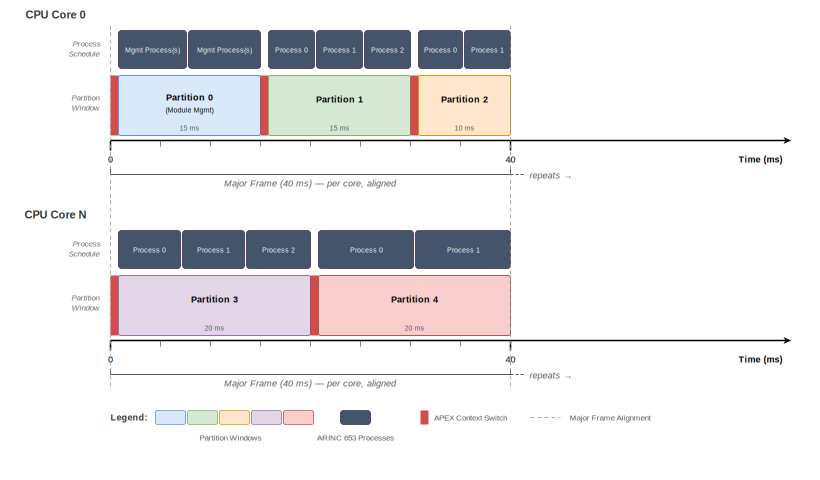

<!--
SPDX-License-Identifier: CC-BY-SA-4.0
-->
<!-- markdownlint-disable MD013 -->

# Aerospace Xen Mixed Criticality System - Working Session

This document captures the working session to define an Aerospace Xen mixed criticality system example. The outcome is intended to support a talk at the [ELISA Workshop in London (June 9-11)](https://elisa.tech/event/elisa-workshop-london-2026/), co-hosted by Canonical.

This working session follows the same discussion rules and licenses as our other ELISA Aerospace Working Group calls.

Pull Request - https://github.com/elisa-tech/wg-aerospace/pull/177/changes

## Background

From the [April 9th AeroWG call](../../meeting-minutes/ELISA-AeroWG-Meeting-20260409.md), Ayan and Weber plan to do a combined talk on Xen FuSa plus Aerospace WG product definition. The working group identified the need for a concrete product definition with Xen for mixed criticality to ground the discussion.

Participants: Ivan, Phillip (SysWG), Leonidas, Martin, Weber (and others welcome)

Key points from the discussion:

- Aerospace focus first for June, but should extend to Space
- Seminar talk first to highlight Xen Functional Safety efforts
- Brainstorming
  - Reliability case vs HA — which best showcases the problem space? Draw out the cases and see which to focus on first for the workshop.
  - Where does RTEMS fit within what environment with what services? (Could use as one of the mixed partitioning scenarios and outline an example workflow like AI processing for the workshop)
  - Add a mixed criticality example for space (like SoDev) to the Xen workshop talk

## Goals

1. **Reference system concept by June workshop** — A defined mixed criticality partition layout with safety levels assigned, suitable for presentation and discussion. The diagram needs all software elements annotated with SWL (boot, hypervisor, each partition, housekeeping).
2. **Align common problems across domains** — Identify problems like fault management that should have common solutions across automotive, aerospace, and space. Zephyr is willing to adapt process and practice to match safety plans.
3. **Safety certification in context of a hardware environment** — The aerospace perspective on Xen use is certification within a specific hardware context, not abstract safety claims. Ground the dissimilar core concept on a specific platform: ZCU102 (from [SystemsWG demo](https://github.com/elisa-tech/wg-systems/blob/main/Documentation/xen-demo-zcu102/Readme.md))? Future RISC-V? ARM A+R cluster?
4. **Clarity of use between automotive and aerospace** — Use the SoDev comparison to help people understand the differences and why they exist, not to seek alignment but to provide clarity. ASIL to DAL comparison slide — update/reuse [Munich presentation](https://directory.elisa.tech/workshops/2025-11-Munich/2-9-Matt_Webber_-_Industry_Safety_Levels_vs_Aerospace_Use_Cases.pdf).
5. **Economics of Xen** — Why Xen vs. Jailhouse, BAFÖ, seL4, other hypervisors, or non-hypervisor approaches? Should hypervisor study be an ELISA WG goal?
6. **Xen code acceptance and upstream sustainability** —  **(ACTION: Ayan)** Does Xen plan to have a code acceptance process that is upstream-accepted and practical without forking? Include country of origin and legal considerations.
7. **cFS Software Bus bridging** — Define in the example how cFS messages cross domain boundaries via static shared memory (Req P-8, IPC-1, IPC-2).

## Workshop Talk — Slide Outline

Target: [ELISA Workshop in London (June 9-11)](https://elisa.tech/event/elisa-workshop-london-2026/)

1. **ASIL to DAL comparison** — Reuse/update slides from the [Munich workshop presentation](https://directory.elisa.tech/workshops/2025-11-Munich/2-9-Matt_Webber_-_Industry_Safety_Levels_vs_Aerospace_Use_Cases.pdf). Establish the mapping between automotive ASIL levels and aerospace DO-178C DAL/SWL for the audience.
2. **Static system concept and aerospace needs** — Lay out the basic concept: aerospace systems are statically configured, deterministic, and certified per configuration. Contrast with automotive's dynamic, updateable model. This frames _why_ the differences exist.
3. **Automotive SoDev as context** — Walk through the AGL SoDev architecture to establish common ground. Use the comparison table to help the audience understand the differences (not gaps — clarity of use, not alignment).
4. **Economics of Xen** — Why use Xen vs. other options (Jailhouse, BAFÖ, seL4, other hypervisors, or non-hypervisor approaches)? What does the open source safety ecosystem look like? Should the study of hypervisors be part of ELISA WG goals generally? - 4/30 discussion - careful about comparison - speak features instead  (why xen for certification). specifically could talk the economics reason for why
5. **Xen code acceptance and upstream sustainability** — Does Xen plan to have a code acceptance process and development practice that is upstream-accepted and practical for initial development and long-term support without creating a fork? Country of origin and legal considerations as part of code acceptance. **(ACTION: Ayan)** - 4/30 discussion - code upstream could be back up material....
6. **Safety island vs. application cores** — Dedicated safety processor (R/M-core) supervising application cores. How does this map in automotive (SoC safety islands) vs. aerospace (watchdog/health monitor, lockstep cores)? Where does it sit relative to Xen — outside the hypervisor, or as a highest-privilege partition? **(ACTION: Ayan)**
7. **Aerospace mixed criticality reference system** — Present the brainstorming diagram with all software elements and safety levels annotated (boot, housekeeping, partitions). Goal: safety certification in the context of a hardware environment.
8. **Common problem alignment** — 1. Fault management as an example of a problem that should be common across domains (automotive, aerospace, space). 2. Zephyr is willing to adapt process and practice to match safety plans, how does Xen view this?
9. **Reference system timeline and goals** — Timeframe for the reference system concept, next steps, and call for participation.
   1.  Minimal SLOC - < 150kSLOC (max at link time)
   2.  Designed for a safe state after boot (segmented boot vs runtime)
   3.  TBD, do a absolute minimum example of deployment to match minimal SLOC idea
10. From the seminar, there was a "slide: End to end bidirectional traceability using OFT"
  - For the workshop, we should make a version that shows the artifact relationship between the ISO/DO178C efforts

## Mixed Criticality — Brainstorming

The following is based on the [demo environments](../../demos/docs/embedded-environments/Readme.md). The example configurations build on the [standalone](../../demos/docs/embedded-environments/Standalone.md) Cabin Lights demo to show how it can be re-hosted into a partitioned Xen environment.

For reference, the published (simpler) configurations:

- [Basic Cabin Lights on Xen](../../demos/docs/embedded-environments/MixedFunctions.md#basic-cabin-lights)
- [cFS Cabin Lights on Xen](../../demos/docs/embedded-environments/MixedFunctions.md#cfs-cabin-lights)
- [cFS Cabin Lights w/ Ground Simulation on Xen](../../demos/docs/embedded-environments/MixedFunctions.md#new-cfs-cabin-lights-w-ground-simulation)

The following brainstorming diagram was created in Dec 2025 and updated during this working session:

> **Diagram status:** The diagram now shows all software elements in the system with safety levels annotated — including boot/firmware (SWL-A), the safety island (R/M-core, SWL-A), the hypervisor with FuSa components, ARINC 653 IPC, the debug partition (SWL-E, lab-only), and the dissimilar core brainstorm (SWL-A).

### Assumptions

Based on the [Xen FuSa architecture requirements](xen-fusa-requirements.md), the following assumptions apply to our mixed criticality system design:

1. **Xen native is the operating environment** — The hypervisor runs directly on hardware (Type 1). Xen components are designed to DO-178C Level A / LOR-1. Partitions inherit isolation guarantees from the hypervisor.
2. **Linux is at most SWL-D** — Linux partitions are constrained to Software Level D (or uncertified/Level E) in this reference system. Higher criticality workloads use RTEMS or bare-metal. Because the hypervisor provides SWL-A time and space partitioning guarantees between domains, Linux's memory footprint, RAM usage, and general resource consumption are flexible within its allocated partition — there is no need to minimize the kernel for isolation purposes. Any I/O used by a Linux partition is either directly mapped (passthrough) or paravirtualized via VirtIO through another SWL-D domain (the Driver/Hardware Domain), so Linux I/O does not affect higher-criticality partitions.
3. **RTEMS is SWL-B** — RTEMS partitions target Software Level B for safety-critical workloads. Bare-metal partitions may target Level A.
4. **Zephyr is IEC 61508 SIL3 (maps to SWL-C)** — Zephyr is currently certified to IEC 61508 SIL3. In the DO-178C mapping, SIL3 corresponds to SWL-C. Zephyr is actively working toward ASIL-D (beyond SIL3), which may reach SWL-B equivalence as that effort matures.
5. **The system is statically configured** — Aerospace systems are certified per configuration. Partition layouts, schedules, memory allocations, and I/O assignments are defined at build time and do not change at runtime. Configuration is expressed via device tree: a top-level device tree for the hypervisor and per-partition device trees for each guest (Req C-5, C-6).
6. **I/O approach depends on safety level** — VirtIO (paravirtualized) is acceptable for SWL-D and below. For higher safety levels, I/O uses either passthrough or a client/server approach. The VirtIO Backend/Frontend in the brainstorming diagram is valid for the Linux (SWL-D) partitions.
7. **Inter-partition communication uses ARINC 653 ports over static shared memory** — Sampling and queuing ports provide the inter-partition communication model, configured via device tree at boot. The Comm App / Comm Driver pair in the diagram uses this mechanism to bridge cFS Software Bus messages across domain boundaries.
8. **ARINC 653 scheduling is available** — The hypervisor provides an ARINC 653 scheduler with major/minor frame model. Partition schedules are set at build time and cannot be redefined at runtime. Each processing core executes a single Module Schedule consisting of a repeating Major Frame divided into Partition Time Windows. Each partition is assigned to exactly one core — a partition does not span or migrate across cores. Within a Major Frame, each Partition Time Window grants exclusive use of that core to the assigned partition for a fixed duration; the partition's ARINC 653 processes (threads) execute within that window under priority-preemptive intra-partition scheduling. Context switches between Partition Time Windows are managed by the hypervisor (APEX). _(Note: a privileged partition may optionally be granted the ability to switch between pre-defined Module Schedules at runtime.)_

9. **Partitions are independent by default** — No shared resources unless explicitly configured. This simplifies the interference argument for certification.
10. **Fault isolation is per-partition** — Progressive fault handling (WARM → COLD → Disable → Module Reset). Lower criticality partitions can be disabled; higher criticality partitions cannot.
11. **Debug partition is included but marked lab-only** — Debug interfaces are Level E and must be disabled or removed for certification. The demo architecture includes a Debug partition for development and verification.
12. **Multi-core requires interference analysis** — All cross-core interference channels must be identified and bounded. Cache must be exclusively allocated per core (cache coloring). Dissimilar cores (A vs R) add analysis burden.

### Expanded Partition Layout

The brainstorming diagram shows all software elements in the system with safety levels annotated, including boot software, the safety island, and the debug partition. The full partition layout is:

| Domain                             | OS / Runtime | SWL                        | Contents                                                                                        | Notes                                                                                                                                       |
|------------------------------------|--------------|----------------------------|-------------------------------------------------------------------------------------------------|---------------------------------------------------------------------------------------------------------------------------------------------|
| **Safety Island**                  | Bare-metal   | **A**                      | Hardware Watchdog / Health Monitor, BIT/BIST/POST, Bare-metal Runtime                           | Runs on dedicated R/M-core **outside Xen**. Supervises application cores (Req F-1 through F-4)                                              |
| Dom !0 (Privileged Control Domain) | Minimal OS   | **A**                      | Health Monitor Hypercalls, I/O Manager, Cfg Manager, VM Mgmt & Monitoring, Kernel/Runtime       | Privileged partition per Xen FuSa XenArch (SWL-A). Health Monitor interface relays partition-level faults to the safety island              |
| Dom D (Driver/Hardware Domain)     | Linux        | D                          | Kernel, **VirtIO Backend**, **Ethernet** driver                                                 | Explicit VirtIO backend placement and Ethernet driver in the hardware domain                                                                |
| Dom U (App Domain)                 | Linux        | D                          | Light, Light Server, Light Switch, Kernel, **VirtIO Frontend**, **Ethernet**                    | Explicit VirtIO frontend pairing with the backend in Dom D                                                                                  |
| Dom U (App Domain)                 | Linux + cFS  | D                          | Light, Light Server, Light Switch Vehicle, **Comm App**, Kernel, **Shared Memory (A653 Ports)** | cFS middleware layer, Comm App for cross-domain messaging via ARINC 653 sampling/queuing ports over shared memory (Req P-8, IPC-1, IPC-2)   |
| Dom U                              | Zephyr       | **IEC 61508 SIL3** (SWL-C) | Light Switch Ground, **Comm Driver**, Runtime, **Passthrough I/O**                              | Zephyr certified to IEC 61508 SIL3 (maps to SWL-C); working toward ASIL-D / beyond SIL3 (Assumption 4). Uses passthrough I/O (Assumption 6) |
| Dom U                              | RTEMS        | **B**                      | Light Switch Ground, **Comm Driver**, Runtime, **Passthrough I/O**                              | RTEMS targets SWL-B for safety-critical workloads (Assumption 3). Uses passthrough I/O, not VirtIO (Assumption 6)                           |
| Dom U _(brainstorm)_               | RTEMS + cFS  | **B**                      | **cFS**, Runtime                                                                                | Second RTOS domain running cFS — shows cFS portability across runtimes                                                                      |
| Dom U _(brainstorm)_               | Bare-metal   | **A**                      | Safety-Critical Application, Bare-metal Runtime, **Passthrough I/O**                            | Dissimilar redundancy concept: A vs R core on ARM multi-cluster same SoC. Requires interference analysis (Req MC-1, MC-2)                   |
| Dom U (Debug)                      | —            | **E**                      | Console, Trace, Runtime                                                                         | **Lab-only** — must be disabled or removed for certification (Assumption 11, Req S-4). Dashed border in diagram                             |

Key architectural details visible in the brainstorming diagram:

- **Safety Island (R/M-core)** — A dedicated safety processor running bare-metal at SWL-A, **outside Xen**, providing hardware watchdog, health monitoring, and BIT/BIST/POST. The safety island supervises all application cores and can trigger module reset independently of the hypervisor. Relates to Xen FuSa Req F-1 through F-4.

  The trustworthiness of the safety island depends on demonstrating that it is truly isolated from the application cores it monitors — a failure on the A-cores (including a hypervisor fault) must not be able to propagate to the R/M-core. This requires hardware-level evidence: separate power domains, independent clock sources, dedicated reset lines, and no shared bus masters or memory controllers between the safety island and the application cluster. On SoCs where full electrical isolation is not available (e.g., shared interconnect fabric), an **architectural mitigation** approach may be used — demonstrating through analysis of the SoC architecture that the shared resources cannot create a common-mode failure path, or that hardware protection mechanisms (e.g., firewalls, MPU regions, bus partitioning) bound the interference to an acceptable level. The specific hardware details of the target platform determine which approach is viable, making this inherently a platform-specific argument that must be part of the safety case.
- **Boot/Firmware layer** — Shown at the bottom of the stack at SWL-A. Covers image integrity, boot fault recovery, selecting active partitions, placing images in memory, and passing control to Xen. Passes the top-level device tree that configures partitions, scheduling, and I/O assignments (Req C-5, C-6). Aligned with the Xen FuSa Boot Layer description.
- **Privileged Control Domain (Dom !0, SWL-A)** — The privileged partition at SWL-A, expanded from the original to include Health Monitor Hypercalls, I/O Manager, and Cfg Manager per the Xen FuSa XenArch diagram. The Health Monitor interface in Dom !0 relays partition-level fault information and supports the progressive fault response (WARM → COLD → Disable → Module Reset).
- **Hypervisor layer with FuSa components** — The Xen layer now explicitly annotates ARINC 653 Scheduling, Domain Management, Resource Allocation (MMU/IOMMU/Cache Coloring), Interrupts, and Grant Tables — matching the Xen FuSa Logical View hypervisor component decomposition. All components at SWL-A.
- **ARINC 653 Ports IPC layer** — A dedicated bar between the hypervisor and partitions shows the inter-partition communication mechanism: ARINC 653 sampling/queuing ports over static shared memory, configured via device tree (Req P-8, IPC-1, IPC-2).
- **VirtIO Backend/Frontend split** — The driver/hardware domain (Dom D) hosts VirtIO backends with Ethernet, while application DomUs run VirtIO frontends. VirtIO is acceptable for SWL-D and below (Assumption 6); higher safety level partitions use passthrough I/O.
- **Comm App / Comm Driver pair** — A communication application in the cFS Linux domain paired with a Comm Driver in the RTOS domain, bridged via ARINC 653 ports. This maps cFS Software Bus messages to the inter-partition communication model (Assumption 7, Goal 7).
- **Debug partition (SWL-E, lab-only)** — Shown with dashed border. Provides console and trace access for development and verification. Must be disabled or removed for certification (Assumption 11, Req S-4).
- **Dissimilar redundancy (SWL-A, brainstorm)** — A bare-metal partition on a dissimilar core (A vs R core on ARM multi-cluster) for safety-critical applications. Uses passthrough I/O. Shown with dashed border as a brainstorm concept. Requires interference analysis per Req MC-1, MC-2.
- **SWL annotations on all elements** — Every partition, runtime, and system-level software element is annotated with its DO-178C Software Level, fulfilling Goal 1.

## SoDev Comparison — Automotive vs. Aerospace

The [AGL SoDev (Software Defined Vehicle) architecture](https://static.sched.com/hosted_files/ossjapan2025/d0/AGL%20Update%20Miner%20ALS%202025.pdf) ([project page](https://www.automotivelinux.org/announcements/sodev/)) provides the automotive reference for mixed criticality on Xen. The following is the SoDev architecture block diagram:

_(Source: [AGL SoDev Announcement](https://www.automotivelinux.org/announcements/sodev/))_

The table below compares the automotive SoDev deployment against our aerospace brainstorming diagram, using the [Xen FuSa requirements](xen-fusa-requirements.md) as ground rules. The intent is to help people understand the differences and why they exist — not to seek alignment, but to provide clarity of use.

| Aspect                              | AGL SoDev (Automotive)                                                                                    | AeroWG Brainstorming (Aerospace)                                                                              | Status       | Notes                                                                                                                                                                                                                                                                                                                                                                       |
|-------------------------------------|-----------------------------------------------------------------------------------------------------------|---------------------------------------------------------------------------------------------------------------|--------------|-----------------------------------------------------------------------------------------------------------------------------------------------------------------------------------------------------------------------------------------------------------------------------------------------------------------------------------------------------------------------------|
| Workload consolidation              | Multiple automotive workloads (Infotainment, Instrument Cluster, ADAS) on single SoC                      | Multiple aerospace partitions with different criticality levels (vehicle cFS, ground sim, RTOS light control) | ✅ Covered    | Multiple distinct criticality levels across domains                                                                                                                                                                                                                                                                                                                         |
| VirtIO                              | Standardized VirtIO interfaces across all domains                                                         | VirtIO Backend in Dom D, VirtIO Frontend in DomU, Ethernet driver pairing                                     | ✅ Resolved   | VirtIO is acceptable for SWL-D and below. Higher safety levels use passthrough or client/server I/O. Linux partitions (SWL-D) use VirtIO; RTEMS/bare-metal partitions use passthrough                                                                                                                                                                                       |
| RTOS integration                    | Zephyr as first-class domain                                                                              | Zephyr, RTEMS, and bare-metal all shown as options; second RTOS domain running cFS                            | ✅ Covered    | Multiple RTOS/runtime options                                                                                                                                                                                                                                                                                                                                               |
| Inter-domain communication          | VirtIO + communication buses between zones                                                                | Comm App / Comm Driver pair via ARINC 653 ports over static shared memory                                     | ✅ Covered    | ARINC 653 sampling/queuing ports over shared memory. Automotive uses dynamic buses; aerospace uses static device-tree-configured channels                                                                                                                                                                                                                                   |
| Dissimilar / heterogeneous cores    | Implicit (different SoC targets)                                                                          | Explicit brainstorm: A vs R core, big.LITTLE, multi-cluster on same SoC                                       | ✅ Conceptual | Requires interference analysis per Xen FuSa (Req MC-1, MC-2)                                                                                                                                                                                                                                                                                                                |
| Safety island vs. application cores | Safety island (dedicated R/M-core) monitors application cores; common in automotive SoCs (e.g., NXP S32G) | Safety Island partition on dedicated R/M-core outside Xen: HW watchdog, health monitor, BIT/BIST at SWL-A     | ✅ Addressed  | Aerospace pattern: dedicated safety processor (or lockstep core) supervises application partitions, runs outside Xen as bare-metal watchdog. Dom !0 Health Monitor Hypercalls relay partition faults. Relates to Xen FuSa (Req F-1 through F-4)                                                                                                                             |
| Container support                   | Linux Containers for in-domain app isolation                                                              | No container layer                                                                                            | ⬜ N/A        | Aerospace uses hypervisor-level partitioning per ARINC 653, not containers. Xen FuSa partitioning (Req P-1 through P-6) provides equivalent isolation                                                                                                                                                                                                                       |
| HMI / Display virtualization        | Unified HMI (multi-display from Panasonic)                                                                | No HMI layer                                                                                                  | ⬜ Different  | Aerospace display systems use ARINC 661 (Cockpit Display System) standard. Display servers (e.g., User Applications) render to display units via a defined widget protocol. This is a fundamentally different architecture from automotive HMI virtualization — displays are certified separately and communicate via ARINC 661 defined interfaces, not shared framebuffers |
| Hardware abstraction                | Cloud, QEMU, and real SoC targets                                                                         | QEMU only (with future hardware intent)                                                                       | 🔶 Partial   | Xen FuSa supports ARM64/RISC-V/x86_64 (Req T-1). Aerospace goal is certification in context of a specific hardware environment                                                                                                                                                                                                                                              |
| Cloud / CI integration              | Cloud-based dev, remote deployment, OTA                                                                   | Not addressed                                                                                                 | ⬜ Different  | Aerospace equivalent is dataload/fieldload (ARINC 615a) or ground-based update. OTA is not applicable for certified avionics. Configuration via PDI (Req C-1 through C-3)                                                                                                                                                                                                   |
| Safety framework                    | Collaborating with ELISA for future ASIL                                                                  | Linux at most SWL-D; RTEMS at SWL-B; bare-metal at SWL-A                                                      | ✅ Defined    | Key difference: automotive targets ASIL; aerospace targets DO-178C DAL/SWL. See [ASIL to DAL comparison slides](https://directory.elisa.tech/workshops/2025-11-Munich/2-9-Matt_Webber_-_Industry_Safety_Levels_vs_Aerospace_Use_Cases.pdf)                                                                                                                                  |
| Scheduling model                    | Linux CFS / container scheduling                                                                          | ARINC 653 time partitioning                                                                                   | ✅ Defined    | Xen FuSa provides ARINC 653 scheduling (Req SC-1 through SC-5). Aerospace requires deterministic, static schedules — fundamentally different from automotive's dynamic scheduling                                                                                                                                                                                           |
| Fault handling                      | Application-level                                                                                         | Progressive partition-level (WARM → COLD → Disable → Module Reset)                                            | ✅ Defined    | Common problem across domains. Xen FuSa provides the mechanism (Req F-1 through F-4). Zephyr willing to adapt process/practice to match safety plans                                                                                                                                                                                                                        |
| System configuration                | Dynamic, updateable at runtime                                                                            | Static, certified per configuration via device tree                                                           | ⬜ Different  | Aerospace systems are statically configured at build time via device tree (Assumption 5, Req C-5, C-6). This is the fundamental architectural difference                                                                                                                                                                                                                    |
| Multi-SoC / Zonal                   | Zonal architecture across multiple SoCs                                                                   | Single SoC (but dissimilar core brainstorm hints at multi-cluster)                                            | 🔶 Partial   |                                                                                                                                                                                                                                                                                                                                                                             |
| Build system                        | Yocto-based integrated build for all domains                                                              | Separate builds (demo-cert-linux, demo-cert-xen) + Nix                                                        | ❌ Gap        |                                                                                                                                                                                                                                                                                                                                                                             |

## Additional Reference Material

### Mixed Criticality Research (UP2DATE)

From Leonidas — reference for mixed criticality coming from a cyber approach plus safety:

- [UP2DATE Project Website (archived)](https://web.archive.org/web/20201230204424/https://h2020up2date.eu)
- [CORDIS Reporting](https://cordis.europa.eu/project/id/871465/reporting)
- [Baseline Definition Document](https://web.archive.org/web/20201230204424/https://h2020up2date.eu/wp-content/uploads/2020/07/D2.2_Baseline-Definition_v1.0.pdf)

EU Horizon 2020 project (€3.8M, 2020–2022) led by IKERLAN with BSC participation (Leonidas contributed timing analysis and monitoring work). UP2DATE developed a framework for safe and secure over-the-air software updates for mixed-criticality cyber-physical systems. The project defined safety and security (SASE) contracts for composable updates, built middleware for modular software updates on heterogeneous multi-core platforms, and validated the approach in railway and automotive use cases. Key outputs relevant to our work: a safety and security architecture defended before a certification authority, monitoring techniques for runtime validation of updated partitions, and a modular update approach for safety-relevant systems that preserves partition isolation — directly applicable to the static-configuration-with-pre-defined-schedules model in our aerospace reference system.

### Safety Barrier for COTS Co-existence with Safety Functions

From Leonidas / Ivan R (BSC) — safety barrier concept to allow Linux + GPU to co-exist with safety functions (COTS incorporation in mixed criticality):

- [Case-Study for Integration of COTS SoC Devices in Reliable Space Systems for On-Board Processing](https://ieeexplore.ieee.org/document/10396004) ([open access](https://upcommons.upc.edu/server/api/core/bitstreams/aa16766c-6c29-4891-83cb-8073ddcc5fea/content))
- [Presentation at ESA EDHPC 2023 Workshop](https://indico.esa.int/event/445/contributions/8413/)

Rodriguez-Ferrandez, Steenari, Tali, Kosmidis, Tonicello (BSC / ESA, EDHPC 2023). An ESA internal working group studied the concept of hardware "safety barriers" to prevent failure propagation from COTS equipment to other on-board units. This enables Class IV (COTS) equipment to fly on higher-class (Class I–III) missions. The paper applies this concept to reference implementations using standard form-factor payload processing modules (ADHA) and automotive-grade GPU SoCs, combined with system and software Fault Detection, Isolation and Recovery (FDIR) techniques to improve in-flight availability. Directly relevant to our dissimilar-core brainstorm partition (SWL-A bare-metal) and the safety island concept — the safety barrier pattern is the space-domain equivalent of isolating non-certified COTS workloads from safety-critical functions via hardware-enforced boundaries.

### ISO 26262 vs ECSS Gap Analysis

ESA-funded gap analysis between automotive (ISO 26262) and space (ECSS) safety standards — relevant to the ASIL-to-DAL comparison (slide 1) and cross-domain alignment (slide 8):

- [ASIL2ECSS: Reusing Automotive Certification and Qualification Standards to Lower the Cost of Space Certification and Qualification for COTS Processors/SoC — Presentation (EDHPC 2025)](https://indico.esa.int/event/552/contributions/11077/attachments/7092/12988/ASIL2ECSS_EDHPC_2025.pdf)
- [ASIL2ECSS — Paper (IEEE)](https://ieeexplore.ieee.org/document/11325998/)
- [EDHPC 2025 Session Page](https://indico.esa.int/event/552/contributions/11077/)

Kosmidis, Rodriguez-Ferrandez, Trompouki, Steenari (BSC / ESA, EDHPC 2025). This work investigates whether automotive ISO 26262 certification and AEC-Q100 qualification artifacts for COTS processors and SoCs can be reused to reduce the cost of space certification under ECSS standards. The automotive industry has already invested heavily in qualifying complex SoCs to ASIL-D; this paper maps those artifacts to ECSS requirements to identify what can be directly reused, what needs supplementation (e.g., radiation tolerance), and where gaps remain. Relevant to our workshop because it provides a concrete cross-domain standards mapping methodology — the same approach needed for the ASIL-to-DAL comparison in slide 1, and demonstrates that certification artifact reuse across safety domains is a practical cost-reduction strategy for COTS-based mixed criticality systems.

### Xen in Safety-Critical Systems

- [A Safe & Secure ARINC 653 Hypervisor (DornerWorks)](https://ieeexplore.ieee.org/document/7311411) — DornerWorks extensions to the open source Xen hypervisor targeting DO-178C Level A and Common Criteria EAL 6+ for security. ([ResearchGate](https://www.researchgate.net/publication/261240786_A_safe_secure_arinc_653_hypervisor))
- [DornerWorks — Xen Hypervisor Solutions](https://dornerworks.com/solutions/xen-hypervisor/) — Commercial mixed criticality demonstrations on Xilinx ZCU102 using Xen with isolation between safety-critical and non-critical workloads.
- [Xen Project's Progress Toward Safety Certification (ELISA Blog, 2024)](https://elisa.tech/blog/2024/07/10/xen-projects-progress-toward-safety-certification-stefano-stabellini-amd/) — Stefano Stabellini on Xen as a static partitioning hypervisor targeting ISO 26262 and IEC 61508 certification.
- [A Comprehensive Survey on the Use of Hypervisors in Safety-Critical Systems](https://www.researchgate.net/publication/369838231_A_Comprehensive_Survey_on_the_Use_of_Hypervisors_in_Safety-Critical_Systems) — Qualitative comparison of hypervisors developed or adapted for safety-critical embedded systems.
- [ELISA Seminar — Functional Safety with Xen, Zephyr and Linux](https://elisa.tech/event/elisa-seminar-functional-safety-with-xen-zephyr-and-linux-for-avionics-automotive-and-industrial/) — Ongoing work on functional safety capabilities for Xen alongside Zephyr RTOS and Linux in mixed criticality systems for avionics, automotive, and industrial domains.

### Prior Research — ARM Virtualization and Hypervisor Architecture

- [Dall & Nieh, "KVM/ARM: The Design and Implementation of the Linux ARM Hypervisor"](https://dl.acm.org/doi/10.1145/2541940.2541946) (ASPLOS 2014) — First full system ARM virtualization solution; provides baseline comparison showing Xen Type-1 provides stronger isolation than KVM's hosted model for safety-critical use.
- [Pinto & Santos, "Demystifying Arm TrustZone: A Comprehensive Survey"](https://dl.acm.org/doi/10.1145/3291047) (ACM Computing Surveys, 2019) — In-depth survey of TrustZone technology covering TEEs and hardware-assisted virtualization on ARM, including TrustZone-assisted hypervisors for mixed criticality.
- [Steinberg & Kauer, "NOVA: A Microhypervisor-Based Secure Virtualization Architecture"](https://dl.acm.org/doi/10.1145/1755913.1755935) (EuroSys 2010) — Microhypervisor architecture with TCB an order of magnitude smaller than Xen; establishes Xen Type-1 as the baseline for hypervisor security and isolation research.

### AGL Software Defined Connected Car Architecture

- [The AGL Software Defined Connected Car Architecture (White Paper, 2018)](https://www.automotivelinux.org/wp-content/uploads/sites/61/2018/06/agl_software_defined_car_jun18.pdf)
- [AGL SoDev Announcement and Project Page](https://www.automotivelinux.org/announcements/sodev/)
- [AGL SoDev Update — Miner, ALS 2025 (Presentation)](https://static.sched.com/hosted_files/ossjapan2025/d0/AGL%20Update%20Miner%20ALS%202025.pdf)

Published by the AGL Virtualization Expert Group (EG-VIRT), this white paper defines the open software-defined vehicle architecture that evolved into the SoDev platform referenced in our comparison table. It presents the rationale for using a hypervisor to consolidate multiple automotive workloads (infotainment, instrument cluster, HUD, telematics, ADAS) onto a single SoC, with virtualization providing isolation between safety-critical and non-critical functions. The architecture uses heterogeneous execution environments supporting mixed criticality, communicating through standardized buses — the automotive precursor to the partitioned Xen model we adapt for aerospace. Key differences from our approach: AGL targets dynamic, runtime-updateable configurations while aerospace requires static, certified-per-configuration systems; AGL uses containers within Linux domains while aerospace relies on hypervisor-level ARINC 653 partitioning.

### ELISA

[General link to ELISA Workshop Series (slides and recordings)](https://elisa.tech/workshop-series/)

ELISA Workshops — directly relevant talks:

- [Industry Safety Levels vs Aerospace Use Cases (Munich 2025)](https://directory.elisa.tech/workshops/2025-11-Munich/2-9-Matt_Webber_-_Industry_Safety_Levels_vs_Aerospace_Use_Cases.pdf) — ASIL to DAL comparison
- [Research Questions and Publication Directions of Aerospace WG (Munich 2025)](https://directory.elisa.tech/workshops/2025-11-Munich/1-3-Martin-Research_questions_and_publication_directions_of_Aerospace_WG.pdf) — Martin Halle & Matt Weber
- [Hypervisors Are Scary, So Why Use Them for Enabling Linux for Safety Applications (Munich 2025)](https://directory.elisa.tech/workshops/2025-11-Munich/2-2-Aqib_Javaid_-_Hypervisors_are_scary_so_why_use_them_for_enabling_Linux_for_Safety_Applications.pdf) — Aqib Javaid (Elektrobit) on hypervisor-based safety architectures
- [Architectures for Linux in Railway Safety Applications (Munich 2025)](https://directory.elisa.tech/workshops/2025-11-Munich/2-1-Florian_-_Architectures_for_Linux_in_Railway_Safety_Applications.pdf) — Florian Wühr (Red Hat), cross-domain mixed criticality comparison
- [AGL SDV SoDeV Insights (Munich 2025)](https://directory.elisa.tech/workshops/2025-11-Munich/2-4-Naoto_Yamaguchi_-_AGL_SDV_SoDeV_Insights.pdf) — Mixed criticality with Xen concepts
- [Drawing an Open Source Safety-Critical Landscape (Munich 2025)](https://directory.elisa.tech/workshops/2025-11-Munich/3-4-Philipp-Drawing_an_open_source_safety-critical_landscape.pdf) — Philipp Ahmann on the broader open source safety ecosystem
- [Example System within ELISA as Cross Community Effort with AGL, Xen, Zephyr, and more (Lund 2025)](https://directory.elisa.tech/workshops/2025-05-Lund/1-4-Example_System.pdf) — Systems WG reference system
- [Reproducible Multi Element System Composition with Linux, Xen & Zephyr (Berlin 2023)](https://directory.elisa.tech/workshops/2023-06-Berlin/ELISA_Berlin_Workshop_2023-OSS_NA_ELISA_Systems-WG.pdf) — Systems WG early Xen + Zephyr mixed criticality demo
- [Verification and Validation of the OS and "Certification Package" (Maryland 2024)](https://directory.elisa.tech/workshops/2024-12-Maryland/Verification-and-Validation-of-the-OS-and_certification-package_-Scott-Tashakkor-NASA.pdf) — NASA on V&V and certification packaging
- [cFS Overview (Maryland 2024)](https://directory.elisa.tech/workshops/2024-12-Maryland/cFS-Overview-Richard-Landau-NASA.pdf) — NASA cFS architecture, relevant to cFS partitions in our diagram
- [Lessons from Automotive Grade Linux (Maryland 2024)](https://directory.elisa.tech/workshops/2024-12-Maryland/Lessons-from-Automotive-Grade-Linux-Walt-Miner-Linux-Foundation_AGL.pdf) — AGL lessons applicable to mixed criticality

ELISA Annual Updates:

- [Aerospace WG Update (Feb 2026)](https://directory.elisa.tech/annual-update/2026-02/Aerospace_WG_Updates_2026.pdf) — Matt Weber
- [Systems and Automotive WG Update (Feb 2026)](https://directory.elisa.tech/annual-update/2026-02/Systems_and_Automotive_WG_Updates_2026.pdf) — Philipp Ahmann, includes Xen demo status
- [Space Grade Linux SIG Update (Feb 2026)](https://directory.elisa.tech/annual-update/2026-02/Space_Grade_Linux_SIG_Updates_2026.pdf) — Ramon Roche

### Aerospace WG

- [Product profiles](../product-profiles.md) provide context on the target system constraints and requirements for different aerospace software levels.

#### Systems WG

- [Xen demo on ZCU102](https://github.com/elisa-tech/wg-systems/blob/main/Documentation/xen-demo-zcu102/Readme.md) demonstrates:
  - Xen with Dom0 (Linux) + DomU guests (Zephyr, Apertis/Petalinux)
  - Paravirtualized disk and network
  - Passthrough of SD and NIC controllers
  - QEMU-based alternative setup
