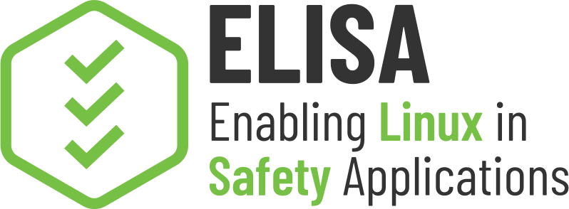

<!--
SPDX-License-Identifier: CC-BY-SA-4.0
-->

## ELISA Aerospace Working Group

# Minutes

## 15 Feb 2024

---

# Agenda

- Roll Call
- Brief Notices
- Announcements
- Goals for 2024
- Organize Notes on Features for Aerospace
  - First Hour Discussion
- Closing

---

# Roll Call

## Attended this meeting
- Martin Halle - Hamburg University of Technology
- Ivan Perez - NASA Ames
- Sam Thompson - Rapita
- Ulises Vega

## Attended recently in the past

- Sebastien Boria - Airbus
- Sam Bristow - Rocket Lab
- Olivier Charrier - Wind River
- Stefano Dell'Osa - Intel
- Martin Halle - Hamburg University of Technology
- Matt Kelly - Boeing
- Abdi Kitesa
- Lenka Koskova - TUL CZ
- Rajesh Kurapati - KMC
- Joseph Lee - Skytrac
- Justin Pearson - Lynx Software
- Ivan Perez - NASA Ames
- Qasim Majeed - Siemens
- Sam Thompson - Rapita
- Steve VanderLeest - Boeing
- Matt Weber - Boeing
- Chuck Wolber - Boeing
- Wanja Zaeske - DLR

---

# Brief Notices

## Code of Conduct and Legal Notices

- ELISA Project meetings involve participation by industry competitors, and it is the intention of the Linux Foundation to conduct all of its activities in accordance with applicable antitrust and competition laws. It is therefore extremely important that attendees adhere to meeting agendas, and be aware of, and not participate in, any activities that are prohibited under applicable US state, federal, or foreign antitrust and competition laws.
  - [Linux Foundation Antitrust Policy](http://www.linuxfoundation.org/antitrust-policy)
- Email communication will be treated as documentation and be received and made available by the Project under the [Creative Commons Attribution 4.0 International License](http://creativecommons.org/licenses/by/4.0). Please refer to the ELISA Technical Charter section 7 subsection iv. for details.
- The discussions in these meetings are exploratory. The opinions expressed by participants are not necessarily the policy of the companies.
- No recordings of working group meetings are permitted. Special provisions may be arranged for recording in advance with explicit consent of the participants.
- The kernel and LF Code of Conduct applies to all communication with this project
  - [Linux Foundation Code of Conduct](https://www.linuxfoundation.org/code-of-conduct/)
  - Linux [Contributor Covenant Code of Conduct](https://git.kernel.org/pub/scm/linux/kernel/git/torvalds/linux.git/tree/Documentation/process/code-of-conduct.rst)
  - Linux Kernel Contributor Covenant [Code of Conduct Interpretation](https://git.kernel.org/pub/scm/linux/kernel/git/torvalds/linux.git/tree/Documentation/process/code-of-conduct-interpretation.rst)

## Mandate

The Aerospace Working Group shall develop use cases to inform and influence Linux architecture and related tools, work to derive technical requirements for avionics operating systems, and seek to enhance and expand avionics software lifecycle processes, practices, and tools to enable use of Linux in avionics systems that are certified to high design assurance levels.

---

# Announcements

## Upcoming Events

- 27 Feb [Workshop on Avionics Systems and Software Engineering (AvioSE'24)](https://aviose-workshop.github.io/) in Linz, Austria
- 2-9 Mar [IEEE Aerospace Conference](https://www.aeroconf.org/) in Montana, USA
- 12-14 Mar [SAE AeroTech](https://www.sae.org/attend/aerotech) in Charlotte, NC, USA
- 16-18 Apr [Aerospace Tech Week](https://www.aerospacetechweek.com/europe/) in Munich, Germany
- 23-25 Apr [Integrated Communications, Navigation and Surveillance](https://i-cns.org/) in Herndon, VA, USA
- 11-12 June [Embedded Real Time Systems (ERTS)](https://www.erts2024.org/) in Toulouse, France
- 15-19 July [IEEE Space Mission Challenges for Information Technology](https://smcit-scc.space) in Mountain View, CA, USA
  - Full paper due 9 Feb extended to Feb 23
- 29 Jul - 2 Aug [AIAA Aviation Forum](https://www.aiaa.org/aviation/presentations-papers/call-for-papers) in Las Vegas, NV, USA
- 1-3 Oct [IEEE Digital Avionics Systems Conference](http://dasconline.org/) in San Diego, CA, USA
  - Abstracts due 23 Feb

## Published Articles

* Posch, Maya, [The Usage of Embedded Linux in Spacecraft](https://hackaday.com/2024/02/10/the-usage-of-embedded-linux-in-spacecraft/), Hackaday, 12 Feb 2024.

---

# Set 2024 Goals

## 2023 Goals

- Establishing our operations as a new working group
- Survey on the state of the art within aerospace on use of Linux and associated certification approach and equivalent Design Assurance Level (DAL)
- Identify the challenges to adopting Linux in aerospace
- Identify candidate use cases using Linux

## Proposed 2024 Goals

These goals were tentatively identified at our last meeting, need to confirm in Feb meeting to finalize.

- Identify the challenges to adopting Linux in aerospace
- Identify candidate use cases using Linux
- Continue discussion on Features Required for Aerospace 
- White paper: Survey on State-of-the-Art Open Source Linux-Like Operating Systems in Avionics
- Increase collaboration, with Subject Matter Experts, with other ELISA working groups, and with groups outside ELISA, such as the Zephyr and Xen communities
- Recruit additional members

Consensus on 2024 goals was confirmed at the 15 Feb 2024 meeting.

---

# Organizing "Features Required for Aerospace" Discussion

## Divide discussion into focused sub-topics

- Scope for feature selection
  - Technical scope
    - Software
      - first, discuss kernel (try to finish, and only discuss broader distribution if necessary to make a decision about kernel)
        - subsystem by subsystem, by DAL
      - second, full distribution (kernel, services, BSP/drivers, API, libraries, applications, bootloader, etc.)
    - Hardware
      - MMU as minimum?, multicore?, availability (physical or simulation at first), validation, crypto, etc.
  - Certification scope 
    - Non-critical - discuss first, DAL-D and lower
      - Decisions about features to include at low DAL do not (necessarily) apply to high DAL
    - Mission-critical
      - Real-time
    - Safety-critical (DO-178C SWL-C or higher)
      - Real-time
    - Security-critical (DO-326A, DO-356A)
      - SAL may not follow DAL, but may actually need to be inverse
  - Location
    - Air
    - Space
    - Ground equipment - secondary discussion
- Use Cases
  - a use case should define a system architecture and function
- Identification of features for use cases
- Mechanisms to configure features (include/exclude)
  - connection to partitioning
  - features that are included/excluded in a real-time aspect
  - different safety features that configured and are certified at different levels (e.g., DO-178C software level)
    - may exclude features, e.g., exclude any feature certified below DAL-B
- Maintenance and Support
  - Need to maintain for decades
- Tools
  - Identify features unique to aerospace, DO-330 qualification 

## Way of working

- Get agreement on one area before moving on to next topic
- Drive one simple use case through all areas 

## Divide discussion into 1 hour topics

### First discussion

"Developing a Minimal, Community Linux Platform for Aerospace"

- Use Case
  - Detect a sensor value out of normal range, light a warning light
  - Simplify communication I/O to only Ethernet
    - temperature and pressure sensor input (received via an Ethernet message)
    - warning light output (transmitted via an Ethernet message)
- Technical Scope
  - Software: device driver within "basic" Kernel, a system function, memory allocation, non-volatile storage, device communication, logging
    - Not yet ARINC 653 in this discussion (for simplicity)
- Certification Scope
  - Non-critical: DAL-D

Logistics:
  - Minimum audience for discussion is 6
  - Check the background of audience for air versus space, if biased, hold a follow-on meeting for missing experience
  - Advertise the meeting via ELISA Aero email list, LinkedIn
  - Invite Linux kernel experts, but perhaps not to first meeting, but once we get to kernel details
  - Hold on Wednesday, March 6

---

# Closing

## Action Items

Located in [GitHub Issues](https://github.com/elisa-tech/wg-aerospace/issues)

New action item:
- Consider creating a database of relevant literature, perhaps on our github site (e.g., bibtex)
- Advertise the discussion

## Round Table

